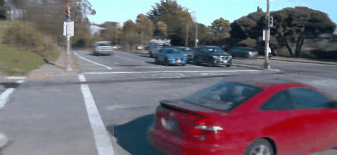
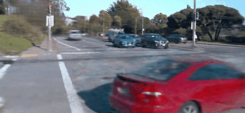

# Dynamic Urban Radiance Fields
This repository contains the Code release for my thesis, 
in which we use Neural Radiance Fields to perform Novel View Synthesis on unbounded dynamic urban scenes. 
We demonstrate our method on the [Waymo Open Dataset](https://waymo.com/open/) 
and data we generate ourselves with [CARLA](https://carla.org).
We combine approaches from [Urban Radiance Fields](https://urban-radiance-fields.github.io) (URF), 
[Mip-NeRF360](https://jonbarron.info/mipnerf360/), [Neural Scene Graphs](https://light.princeton.edu/publication/neural-scene-graphs/) (NSG)
and [BARF](https://chenhsuanlin.bitbucket.io/bundle-adjusting-NeRF/).  


Our method is built on top of [Mip-NeRF](https://github.com/google/mipnerf) in [JAX](https://github.com/google/jax)
and in particular contains our own re-implementation of URFs LIDAR losses, 
Mip-NeRF360s spatial re-parameterisation and BARFs frequency encoding filtering.


The results above are generated from a NeRF that was only trained on 25 Images and their corresponding depth images.

In another experiment we jointly optimise the bounding box poses and the radiance field:




The first gif shows our method when optimising the bounding box pose and the second without optimisation. 

## Installation

Clone this repo. 

```bash
git clone https://github.com/FelTris/durf.git
cd durf
```

Create a new conda environment and depending on what you want to do install dependencies.

```bash
conda create -n durf python=3.6.13; conda activate durf
conda install pip; pip install --upgrade pip
# For waymo data pre-processing use requirements_wod, for carla use requirements_carla
pip install -r requirements_jax.txt
```

Install GPU support for Jax. If you run into trouble here, check for the official Jax installation guide.

```bash
# Remember to change cuda101 to your CUDA version, e.g. cuda110 for CUDA 11.0.
pip install --upgrade jax jaxlib==0.1.65+cuda101 -f https://storage.googleapis.com/jax-releases/jax_cuda_releases.html
```

## Data

For the waymo open data, download the sequences from the official website and run both the waymo_data and waymo_labels notebooks.
To generate the sky masks use an off-the-shelf segmentation network and save the sky pixels as a mask.
We also provide a few examples 
[here](https://drive.google.com/drive/folders/1FENBETwX2K_8qdYIckfUGiLUtrmyol1T?usp=sharing) for data we generate with CARLA.
If you want an example of how the waymo data format is supposed to look, please contact me directly. 
I'm not sure how ok it is otherwise to share waymo open data publically. 

## Training \& Inference

We provide example scripts for training with CARLA and Waymo data in `scripts/`. 
Change the paths to where you put the data on your system. 
[Gin](https://github.com/google/gin-config) configuration files are provided for each dataset in `configs/`. 
To evaluate or render your own trajectory we provide jupyter notebooks in `notebooks/`.

## Citation

If you use this code in your research please cite our work.

```
@mastersthesis{durf22,
  author  = {Felix Tristram and
               Matthias Niessner},
  title   = {Neural Rendering for Dynamic Urban Scenes},
  school  = {Technical University of Munich},
  year    = {2022},
  note    = {Visual Computing Group}
}
```